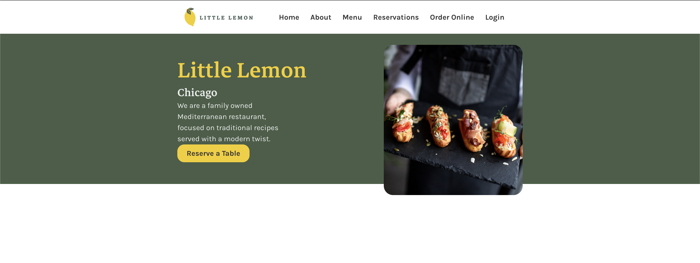
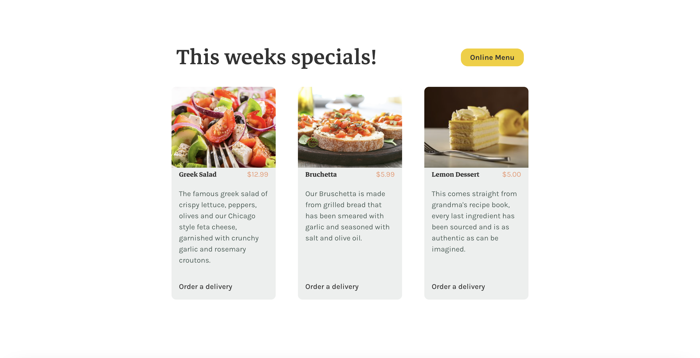
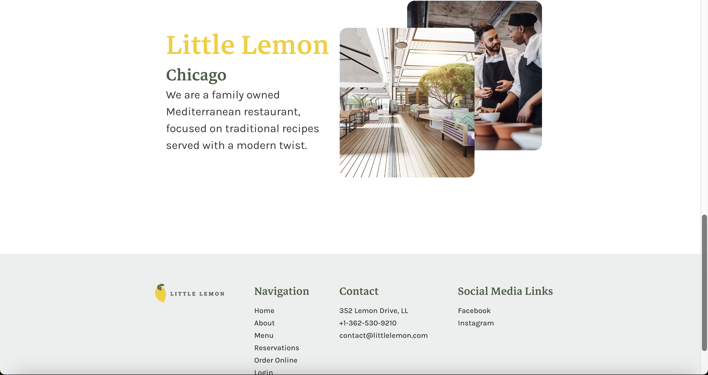

# Little Lemon App - Meta Front-End Developer Capstone Project (Coursera)

In this project, I created a restaurant web app for fictional restaurant Little Lemon making use of technologies learnt during the Meta Front-End Developer course (HTML, CSS, Javascript, React, Jest, React Testing Library and Figma). Features include a responsive and elegant UI to view restaurant information and reservation booking.

